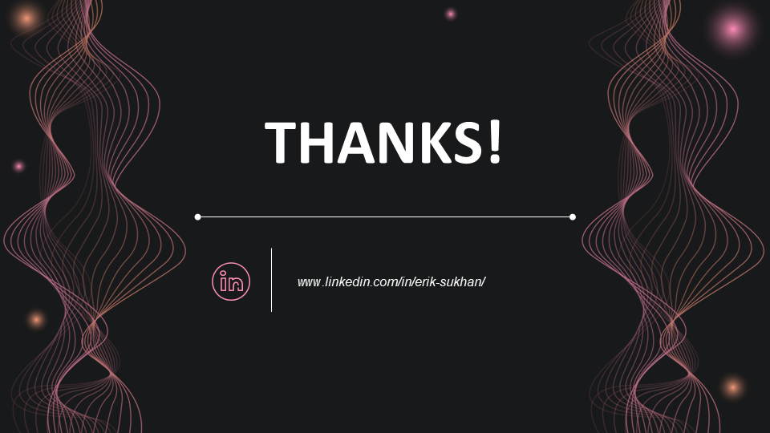

 

# Guitar Tuner App

<!-- ---------- Badges ---------- -->
  

    
    
    
    
    
    
    
    
    
     
  

> Diploma work at university, the mobile android app is designed to facilitate the accounting and control of resources, as well as the exchange of information between military personnel of different ranks.
>
> -----------------
>
> ***In Ukrainian***:
> *Дипломна робота для університету, мобільний android додаток призначений для полегшення ведення обліку та контролю ресурсів, а також обміну інформацією між військовослужбовцями різних рангів.*

## 📖 Table of content

* [📱 `Overview`](#iphone-overview)
* [✨ `Demonstration`](#sparkles-demonstration)
* [👇 `Download`](#point_down-download)
* [🛠️ `Project Setup`](#hammer_and_wrench-project-setup)
* [🛠️ `Architecture`](#hammer_and_wrench-architecture)
* [🛠️ `Tech stack & Open-source libraries`](#building_construction-tech-stack--open-source-libraries)
* [🤝 `Join the team`](#handshake-join-the-team)
* [✍️ `Author`](#pencil2-author)
* [⭐️ `Stats`](#star-Stats)

- [📃 `License`](#scroll-license)

[//]: # (## 📱 Overview)

## :iphone: Overview

#### About this application

> ##### *Tune your guitar with ease using this precise and user-friendly tuner app. Featuring multiple tuning algorithms, customizable presets, and a noise reduction feature, this app ensures your guitar is always in perfect tune*
> 

#### Comparison of pitch detection algorithms:

#### Key Features:
* **Perfect for beginners and experienced guitarists**
* **Intuitive interface**
* **Adaptive design**: Ensures a great experience on any Android device
* **Customizable appearance**: dark/light theme, change display modes for strings (list/grid), different tuner indicator modes, supports multiple music notations (Solfeggio, English, German), supports ukrainian language, e.t.c.
* Automatic tuning mode for quick and easy tuning
* Create/delete your own tuning sets
* Noise reduction for optimal tuning in noisy environments
* Customizable base frequency
* Many available pitch detection algorithms (powered by [TarsosDSP](https://github.com/JorenSix/TarsosDSP/)):
    * [YIN](http://audition.ens.fr/adc/pdf/2002_JASA_YIN.pdf)
    * [FFT YIN (Fast Fourier Transform)](https://en.wikipedia.org/wiki/Fast_Fourier_transform)
    * [MPM (McLeod Pitch Method)](http://miracle.otago.ac.nz/tartini/papers/A_Smarter_Way_to_Find_Pitch.pdf)
    * [AMDF (Average Magnitude Difference Function)](https://ieeexplore.ieee.org/abstract/document/1162598)
    * [DYWA (Dynamic Wavelet)](https://pdfs.semanticscholar.org/1ecf/ae4b3618f92b4267912afbc59e3a3ea1d846.pdf)

[//]: # (## ✨ Demonstration)

## :sparkles: Demonstration

> --------------

[//]: # (👇)

## :point_down: Download

***Download and test latest version***

--------------

[//]: # (## 🛠️ Project Setup )

## :hammer_and_wrench: Project Setup

#### Android Studio IDE

You need to have [Android Studio](https://developer.android.com/studio) to set
up this project locally. After downloading all the requirements, please import the project into
Android Studio, build the project, and click Run.

#### Gradle

Build or run the project with terminal using
`./gradlew assembleDebug` or `./gradlew assembleRelease` command.

--------------------------------

[//]: # (## 🛠️ Architecture)

## :hammer_and_wrench: Architecture

--------------

[//]: # (## 🛠 Tech stack & Open-source libraries)

## :building_construction: Tech stack & Open-source libraries

- Minimum SDK level 24
- [Kotlin](https://kotlinlang.org/) - Official programming language for Android development.
- [Jetpack Compose](https://developer.android.com/compose) - Jetpack Compose is Android’s recommended modern toolkit for building native UI.
- [Coroutines](https://kotlinlang.org/api/kotlinx.coroutines/kotlinx-coroutines-core/kotlinx.coroutines.flow/-flow/) -
  For asynchronous and more..
- [Coroutines Flow](https://kotlinlang.org/docs/reference/coroutines-overview.html) - For streams and alternative Live
  Data..
- [Koin](https://insert-koin.io/) - The pragmatic Kotlin & Kotlin Multiplatform Dependency Injection framework
- [Room DB](https://developer.android.com/training/data-storage/room) - The Room persistence library provides an abstraction layer over SQLite to allow for more robust database access while harnessing the full power of SQLite
- [Satchel](https://github.com/adrielcafe/satchel): A fast, secure and modular key-value storage with batteries-included for Android and JVM.
- [TarsosDSP](https://github.com/JorenSix/TarsosDSP): TarsosDSP is a Java library for audio processing.
- [Android Architecture Components](https://developer.android.com/topic/libraries/architecture) - Collection of
  libraries that help you design robust, testable, and maintainable apps.
    - Lifecycle: Observe Android lifecycles and handle UI states upon the lifecycle changes.
    - [ViewModel](https://developer.android.com/topic/libraries/architecture/viewmodel) - Stores UI-related data that
      isn't destroyed on UI changes.
- [Material Components for Android](https://github.com/material-components/material-components-android) - Modular and
  customizable Material Design UI components for Android.

> --------------

[//]: # (## 🤝 Join the team)

## :handshake: Join the team

Contributions are what make the open source community such an amazing place to be learn, inspire, and create. Any
contributions you make are **greatly appreciated**.

1. Open an issue first to discuss what you would like to change. Report issues in
   the [issue tracker](https://github.com/GitaristErik/GuitarTuner/issues)
1. Fork the Project
1. Create your feature branch (`git checkout -b feature/amazing-feature`)
1. Commit your changes (`git commit -m 'Add some amazing feature'`)
1. Push to the branch (`git push origin feature/amazing-feature`)
1. Open a [pull request](https://opensource.guide/how-to-contribute/#opening-a-pull-request)

> **💬 Discuss?**
>
> Have any questions, doubts or want to present your opinions, views? You're always welcome. You can
> start [discussions](https://github.com/GitaristErik/GuitarTuner/discussions).
>
> --------------

[//]: # (## ✍️ Author)

## :pencil2: Author

👤 **GitaristErik**

* Linked-In: <a href="https://www.linkedin.com/in/erik-sukhan/" target="_blank">***GitaristErik***</a>
* Email: ***GitaristErik@gmail.com***

[//]: # (Feel free to ping me 😉)

> --------------

[//]: # (## ⭐️ Stats)

## :star: Stats

<a href="https://star-history.com/#GitaristErik/GuitarTuner&Date">
  <picture>
    <source media="(prefers-color-scheme: dark)" srcset="https://api.star-history.com/svg?repos=GitaristErik/GuitarTuner&type=Date&theme=dark" />
    <source media="(prefers-color-scheme: light)" srcset="https://api.star-history.com/svg?repos=GitaristErik/GuitarTuner&type=Date" />
    
  </picture>
</a>

[//]: # (## 📃 License)

## :scroll: License

> **Warning**
>
> Please be aware of the following crucial points regarding the GNU General Public License, Version 3 (GPL-3.0):
> - This software is distributed under the terms of the [GNU General Public License, Version 3](LICENSE).
> - Any modifications or derivative works you create must also be licensed under the GPL-3.0.
> - The software is provided "as is," without any warranties or guarantees.
>
> **By using this software, you agree to abide by the terms of the GPL-3.0.**
>
> *For more details, please refer to the [LICENSE](LICENSE) file.*

<table><td>
<a href="#start-content">👆 Scroll to top</a>
</td></table>

